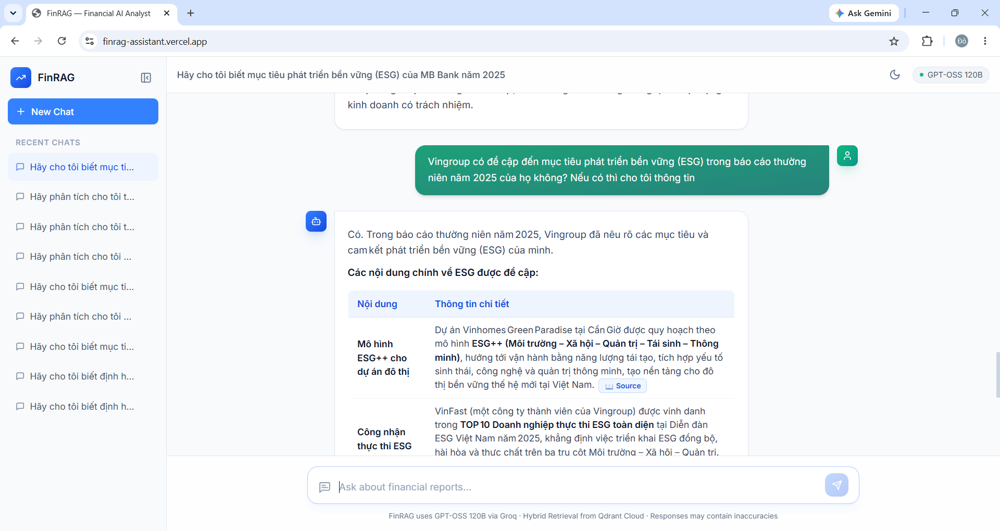
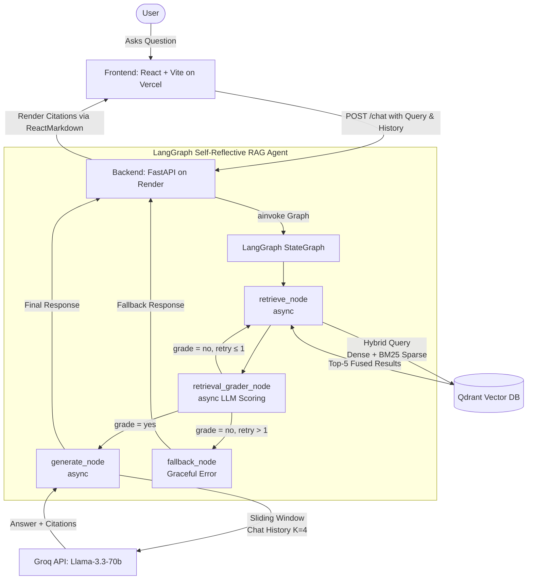

# FinRAG 📈 - Corporate & Financial AI Analyst

> **A Self-Reflective Agentic RAG System for Deep Analysis of Vietnamese Corporate Annual Reports**

[](https://finrag-assistant.vercel.app/)
[](https://finrag-backend-sdny.onrender.com/docs)
[](https://python.org)
[](https://react.dev)

## 🌐 Live Demo

- **Frontend App**: [https://finrag-assistant.vercel.app/](https://finrag-assistant.vercel.app/)
- **Backend API Docs**: [https://finrag-backend-sdny.onrender.com/docs](https://finrag-backend-sdny.onrender.com/docs)

<div align="center">
  
</div>

---

## 📖 Overview

FinRAG is an advanced AI-powered assistant designed to parse, understand, and analyze complex annual reports. Built as an end-to-end **Self-Reflective Agentic RAG pipeline**, it allows users to chat seamlessly with the corporate data of top-tier Vietnamese corporations.

The pipeline now features **Hybrid Search** (dense + sparse BM25 fusion), **LLM-powered Retrieval Grading** with an automatic retry loop, and **Sliding Window Memory** — making it a production-grade, fully async system.

### 📊 Supported Data Sources (2025 Annual Reports)
The system currently hosts the complete annual reports of the following major corporations, encompassing financial metrics, strategic goals, and ESG (Environmental, Social, Governance) directions:
- **Vinamilk** (VNM)
- **Vingroup** (VIC)
- **Hoa Phat** (HPG)
- **MB Bank** (MBB)
- **FPT Corporation** (FPT)

---

## ✨ Key Features

| Feature | Description |
|---------|-------------|
| **Complex Table Parsing** | Utilizes **LlamaParse** to accurately extract and preserve complex financial tables from raw PDF reports. |
| **Self-Reflective Agentic RAG** | A **LangGraph** StateGraph with a dedicated `retrieval_grader_node` — the LLM evaluates its own retrieved context and either proceeds to generation, retries retrieval (max 1 retry), or falls back gracefully. |
| **Hybrid Search (Dense + Sparse)** | **Qdrant** fuses `BAAI/bge-m3` dense embeddings with **BM25 sparse vectors** (`fastembed`) at query time, drastically improving recall for exact financial keywords and ticker symbols. |
| **Fully Async Pipeline** | `retrieve_financial_context` and all LangGraph nodes are `async def` — the FastAPI event loop is never blocked, even during HuggingFace API cold-start retries. |
| **Fault-Tolerant Retrieval** | A 3-attempt retry loop with `asyncio.sleep(20)` gracefully handles HuggingFace Inference API cold starts (504 timeouts) without blocking the server. |
| **Sliding Window Memory (K=4)** | Only the last 4 messages from `chat_history` are injected into the prompt, keeping token consumption bounded and deterministic across long conversations. |
| **Interactive Citations** | Automatically extracts and renders source document names as beautiful, hoverable UI badges to prevent AI hallucinations. |
| **Rapid AI Inference** | Powered by **Llama-3.3-70B-Versatile** via **Groq's** ultra-fast inference API, with fully async `.ainvoke()` calls. |
| **Memory-Optimized Deployment** | HuggingFace Inference API eliminates local PyTorch overhead, running within 512MB RAM constraints on Render's free tier. |
| **Sleek ChatGPT-Style UI** | Modern frontend built with **React** and **Tailwind CSS**, featuring a collapsible sidebar, dark mode, and rich markdown rendering. |

---

## 🏗️ System Architecture & Workflow

The system relies on a decoupled frontend and backend. LangGraph orchestrates a **Self-Reflective** pipeline with conditional routing based on retrieved context quality.



### How It Works:
1. **Data Ingestion (Offline)**: PDF annual reports are processed via LlamaParse, vectorized using the `bge-m3` embedding model, and ingested into **Qdrant Cloud** (Collection: `finrag_assistant_v2`) with both dense and sparse BM25 vectors.
2. **Query Processing**: The user submits a natural language question. The React UI bundles the current query along with previous chat session context (`chat_history`).
3. **Hybrid Retrieval**: `retrieve_node` (async) embeds the query and performs **hybrid search** (dense + BM25 sparse fusion) on Qdrant, fetching the top **5** most relevant document chunks. A 3-attempt async retry loop handles HuggingFace API cold starts transparently.
4. **Retrieval Grading**: `retrieval_grader_node` (async) uses the LLM to score whether the retrieved context is relevant (`yes`/`no`). If `no`, it retries retrieval once, then falls back gracefully after exhausting the retry budget.
5. **Generation**: The graded context and sliding-window chat history (last K=4 messages) are passed to `generate_node`. Llama-3.3-70B acts as a Senior Analyst, strictly citing sources as `[Source: Filename.pdf]`.
6. **Response & UI Parsing**: The final AI response is returned to the frontend. A custom Markdown parser converts citation badges into interactive, hoverable UI elements.

---

## 💻 Tech Stack

| Layer | Technology | Purpose |
|-------|------------|---------|
| **Frontend** | React, Vite, Tailwind CSS | UI components, state management, and styling. |
| **Backend** | FastAPI, Python 3.10+ | Fully async API routing. |
| **Orchestration** | LangGraph, LangChain | Self-reflective agent state machine with conditional edges. |
| **RAG Pipeline** | LlamaIndex | Core retrieval logic and hybrid vector store integration. |
| **Vector DB** | Qdrant Cloud | Hybrid search (dense + BM25 sparse) over document embeddings. |
| **Embeddings** | HuggingFace Inference API (`BAAI/bge-m3`) | Serverless dense text embedding generation. |
| **Sparse Search** | `fastembed` (`Qdrant/bm25`) | Local BM25 tokenization for sparse vector generation. |
| **LLM Provider** | Groq API (`llama-3.3-70b-versatile`) | Lightning-fast async inference for grading and generation. |

---

## 🚀 Local Development Setup

### Prerequisites
- Python 3.10+
- Node.js 18+
- Accounts/API keys for **Groq**, **Qdrant Cloud**, and **HuggingFace**.

### 1. Backend Setup

```bash
# Navigate to the backend directory
cd backend

# Install dependencies (includes fastembed for BM25 hybrid search)
pip install -r requirements.txt

# Create your environment variables file
cp .env.example .env
```

**Required `.env` variables:**
```env
QDRANT_URL=your_qdrant_url
QDRANT_API_KEY=your_qdrant_api_key
GROQ_API_KEY=your_groq_api_key
HF_TOKEN=your_huggingface_token
```

```bash
# Start the FastAPI server
uvicorn main:app --reload --host 0.0.0.0 --port 8000
```
*The backend API will run on `http://localhost:8000`*

### 2. Frontend Setup

```bash
# Navigate to the frontend directory
cd frontend

# Install dependencies
npm install

# Start the Vite development server
npm run dev
```
*The frontend will run on `http://localhost:5173`*

---

## 🔄 Recent Changes (refactor/backend)

| Area | Change |
|------|--------|
| **Async Pipeline** | `retrieve_financial_context` converted to `async def`; `time.sleep` → `asyncio.sleep` |
| **Async Nodes** | `retrieve_node` and `generate_node` are now `async def` with `await llm.ainvoke()` |
| **Self-Reflective Grader** | New `retrieval_grader_node` scores context relevance via LLM JSON output |
| **Conditional Routing** | `route_after_grading` directs flow to generate, retry, or fallback based on grade + retry budget |
| **Sliding Window Memory** | `chat_history` capped at last K=4 messages to prevent token overflow |
| **Hybrid Search** | Qdrant switched to `enable_hybrid=True` with `fastembed` BM25 sparse model |
| **Fallback Node** | `fallback_node` returns a structured user-friendly error after max retries |

---

**Developed for technical demonstration and portfolio showcasing.**
